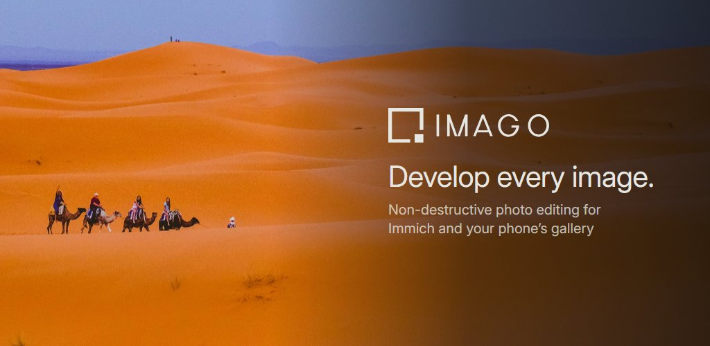
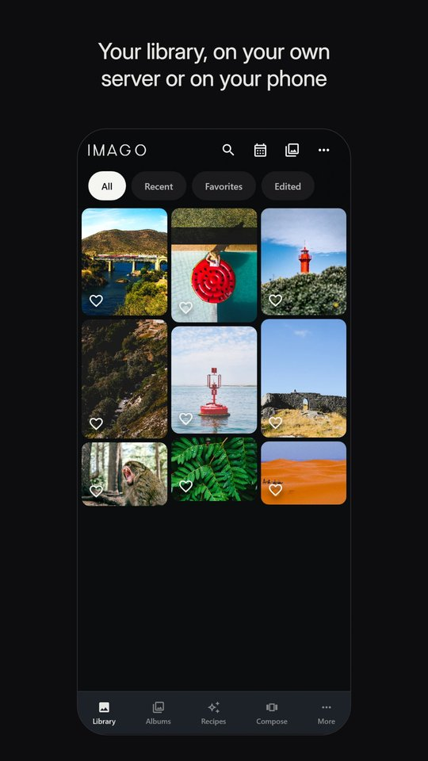
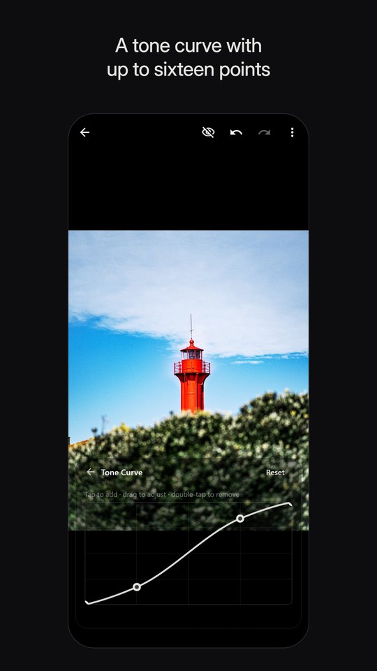
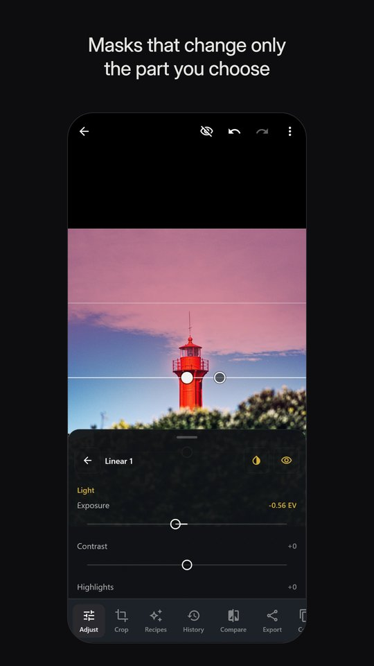
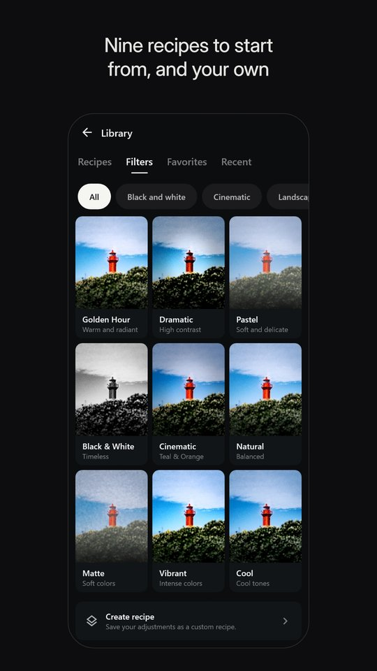
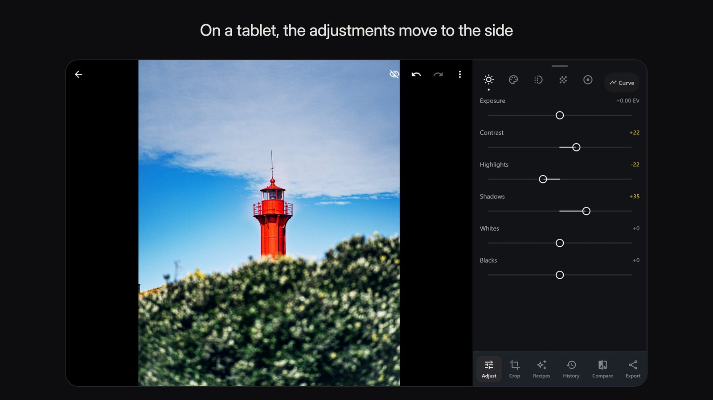
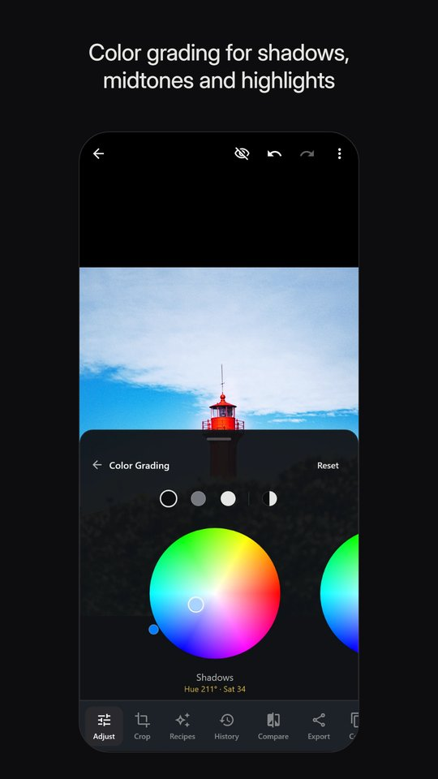
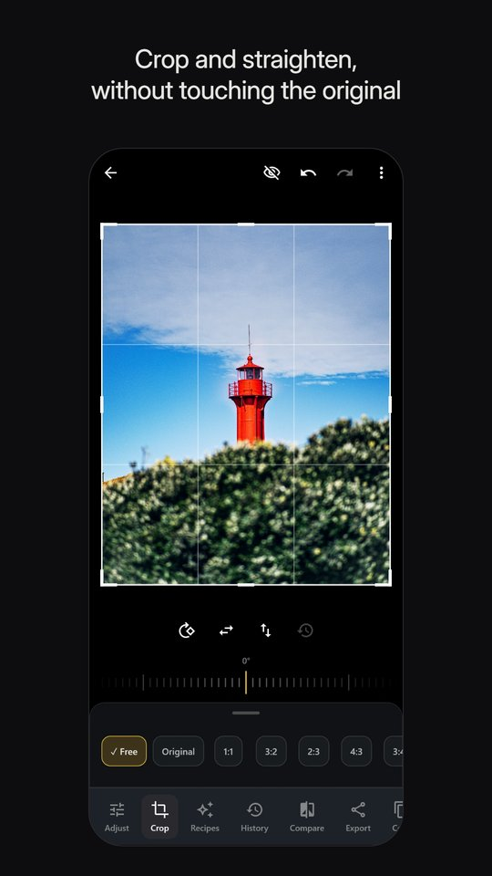
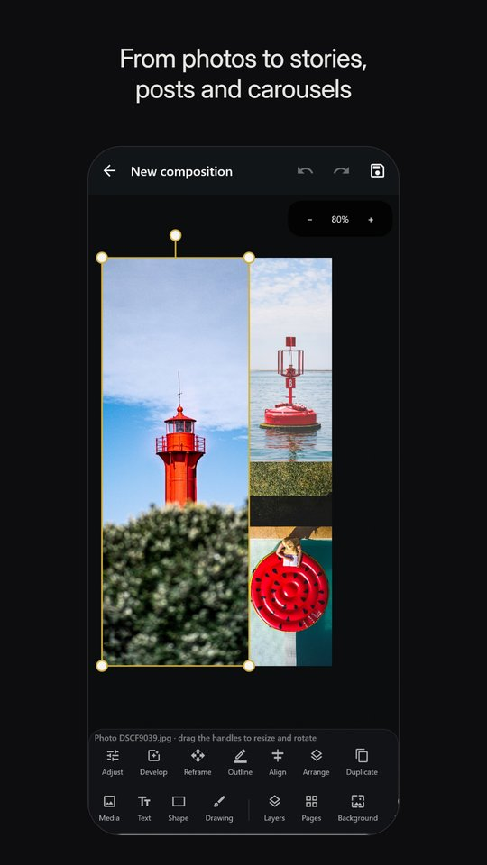

<p align="center">
  
</p>

<p align="center">
  <b>Non-destructive photo editing for your <a href="https://immich.app">Immich</a> library and your phone’s gallery.</b>
</p>

<p align="center">
  <a href="https://imago.742studio.eu">Website</a> ·
  <a href="#building">Build it</a> ·
  <a href="CONTRIBUTING.md">Contribute</a> ·
  <a href="#licence-and-trademark">Licence</a>
</p>

---

IMAGO opens the photos you already have — on your own Immich server or in your phone’s gallery —
and gives them light, color, curves, masks and recipes. The original file is never rewritten:
every edit is kept as a recipe you can change at any time. When you export to Immich, the result
goes back at full resolution, **stacked on the original**, so your timeline doesn’t fill up with
copies.

Every adjustment runs on the device’s GPU at 16 bits per channel, and the export comes out exactly
as the screen shows it. Your photos never pass through anyone else’s server.

<p align="center">
  
  
  
  
</p>

## What it does

**Works with your Immich server**
- Connect with the server address and an API key (Immich 2.6.0 or later). The key only needs
  `user.read`, `asset.read`, `asset.view` and `asset.download`: with those IMAGO edits and exports to
  the device without being able to change anything on the server. `album.read`, `asset.upload`,
  `stack.create`, `stack.read`, `stack.update`, `stack.delete`, `asset.update`, `asset.delete` and the `asset.edit` ones are optional, and each
  turns on only what it does.
- Crop, rotation and mirror are written to Immich's own edits, so the server shows the photo framed
  as in IMAGO without exporting it.
- One library can have several addresses, at home and away; the app uses whichever answers.
- Exports go back to the server at full resolution, stacked on the original.
- No server? IMAGO edits your phone’s gallery the same way.

**The tools developing asks for**
- **Light:** exposure up to ±5 EV, contrast, highlights, shadows, whites and blacks
- **Color:** temperature, tint, vibrance and saturation
- **Detail:** texture, clarity and dehaze · **Effects:** vignette and grain
- **Tone curve** with up to sixteen points
- **Color mixer:** hue, saturation and luminance in eight bands
- **Color grading:** wheels for shadows, midtones, highlights and global, with blending and balance
- **Masks:** linear and radial gradients, with thirteen adjustments that touch only the chosen region
- **Crop and straighten**, free or fixed aspect ratio, rotate and flip
- **Recipes:** nine built in, your own, and copy and paste between photos
- **History** of every step, and the original in one tap

<p align="center">
  
</p>

**Made for phone, tablet and desktop.** On a tablet, in split screen or on a phone turned
sideways, the adjustments move to a column beside the photo. A Windows app shares most of the
interface and logic.

**From photos to a post.** The composer puts photos from your library into stories, posts and
continuous carousels, with text, shapes and freehand drawing. Keep your brand’s colors and fonts in
a kit. Each page comes out as JPEG or PNG.

**On more than one device.** With an optional account, recipes, presets, templates, the brand kit
and compositions sync between devices. The same photo is recognized on another device by its
content, and the edit continues where it left off. Photos themselves never sync.

<p align="center">
  
  
  
</p>

**Private by design.** Processing is local. The Immich address and API key stay encrypted on the
device. The account is optional, and without one nothing leaves the device. No ads and no
analytics.

## Inside the repository

- **Android** app (Android 12 or later, OpenGL ES 3.1), in `app/`.
- **Windows** app built with Compose Desktop, in `desktop/`.
- Most of the interface and logic is shared Kotlin Multiplatform code in `core/`, `feature/` and
  `shared/`.
- Optional multi-device sync through Supabase. The schema and its tests are in `backend/`.

The Immich OpenAPI specifications the client is checked against are pinned in `open-api/`.

## Building

Requirements: JDK 17 and the Android SDK with API 36.

```sh
./gradlew :app:assembleDebug      # Android debug APK
./gradlew testDebugUnitTest       # Android unit tests
./gradlew :desktop:run            # Windows app
./gradlew :desktop:test           # desktop tests
cd backend/tests && npm install && npm test   # Supabase migration tests (PGlite, no Docker)
```

The app builds and runs without any keys: sync is simply unavailable. To build with sync against
your own Supabase project, apply the migrations in `backend/` to it and copy
`local.properties.example` to `local.properties` with your project’s URL and **publishable**
key. Never put the secret key there: it bypasses row-level security, and anything in
`local.properties` ends up in the app.

## Contributing

See [CONTRIBUTING.md](CONTRIBUTING.md).

## Licence and trademark

IMAGO is licensed under the [GNU Affero General Public License version 3](LICENSE), with an
additional permission to link with the purchase libraries of app stores. The copyright notice and
that permission are in [NOTICE](NOTICE).

The sample photographs used by the recipe previews and shown in these screenshots are by Paulo
Marques, under [CC BY 4.0](https://creativecommons.org/licenses/by/4.0/): use them freely,
crediting the author.

The name IMAGO and its logo are not covered by the licence: a fork must use its own name and icon
before it is distributed. See [TRADEMARKS.md](TRADEMARKS.md).

IMAGO works with Immich servers but is not affiliated with or endorsed by the Immich project.
